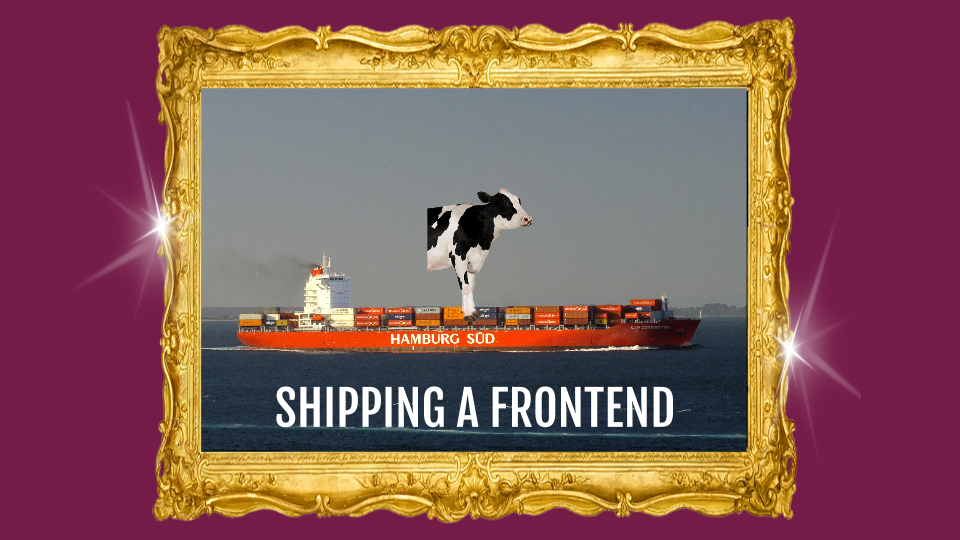
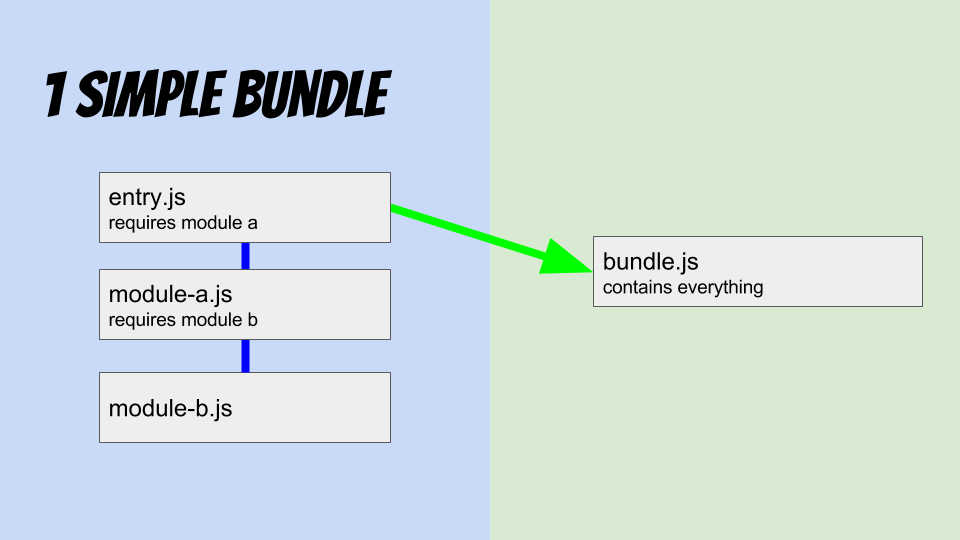
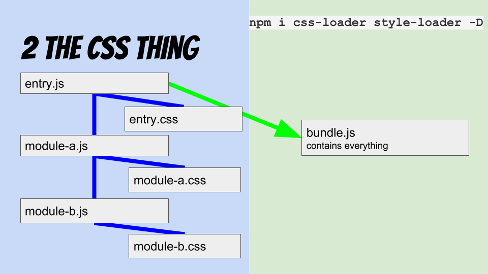
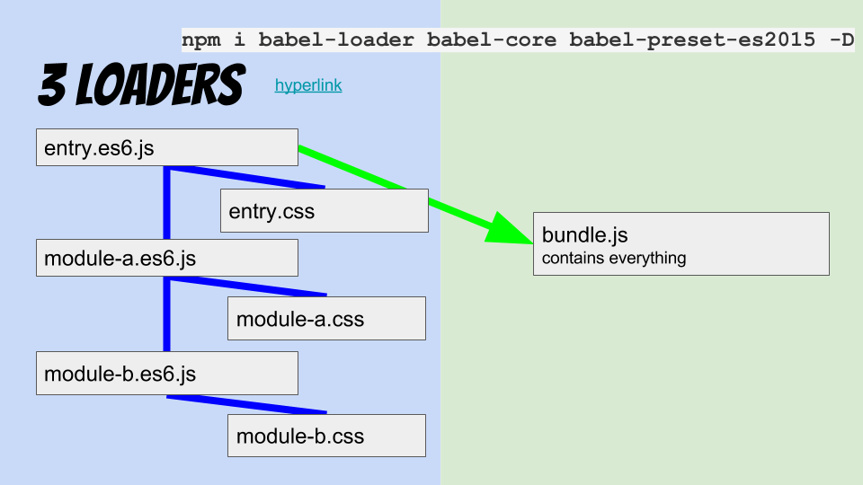
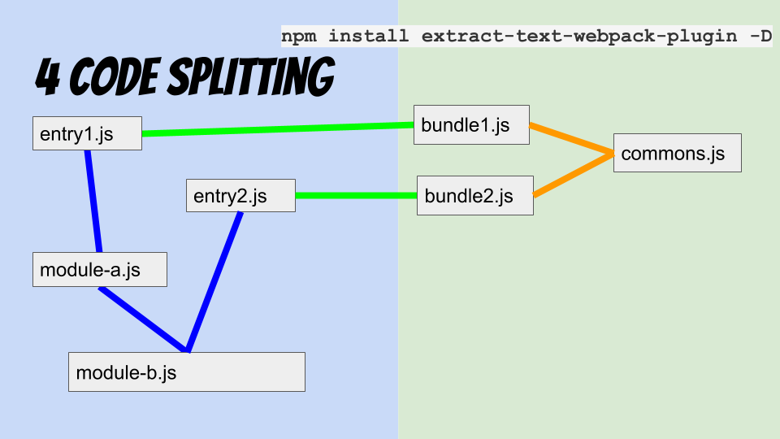

# webpack ftw

[](https://speakerdeck.com/k9ordon/webpack-ftw)

simple steps for shipping a frontend with webpack - [show slides](https://speakerdeck.com/k9ordon/webpack-ftw)

## setup

```sh
npm install webpack -g

npm install webpack-dev-server -g
```

## 1. bundle

simple webpack bundle example with dependencies

```sh
webpack entry.js bundle.js
```




## 2. the css thing
adding css to modules via .js  ```require('style!css!./entry.css')```


```sh
npm i css-loader style-loader -D
```



## 3. loaders

preprocess es6 with loaders. config moved to ```webpack.config.js```

```sh
npm i babel-loader babel-core babel-preset-es2015 -D

webpack --config webpack.config.js
```




## 4. code splitting

extract css files && commons code
```sh
npm install extract-text-webpack-plugin -D
```



## 5. dev server & hmr

start a development server with hot module reload at [localhost:8080](http://localhost:8080/webpack-dev-server/)

```sh
webpack-dev-server --config webpack.config.js --hot --inline -d
```

## 6. production build

build uglified for production

```sh
NODE_ENV=production webpack --config webpack.config.js -p
```
